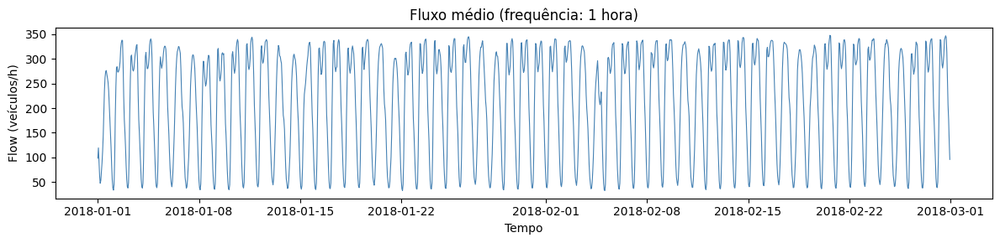
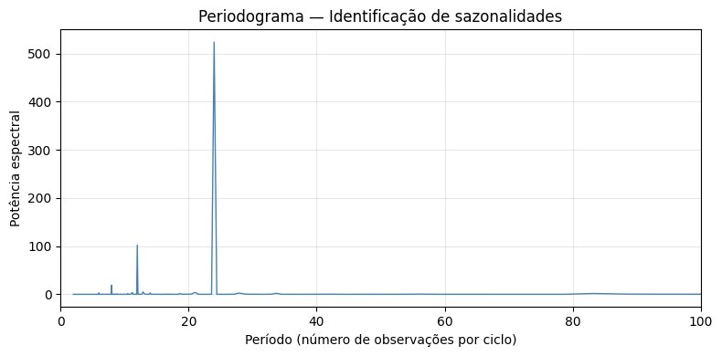
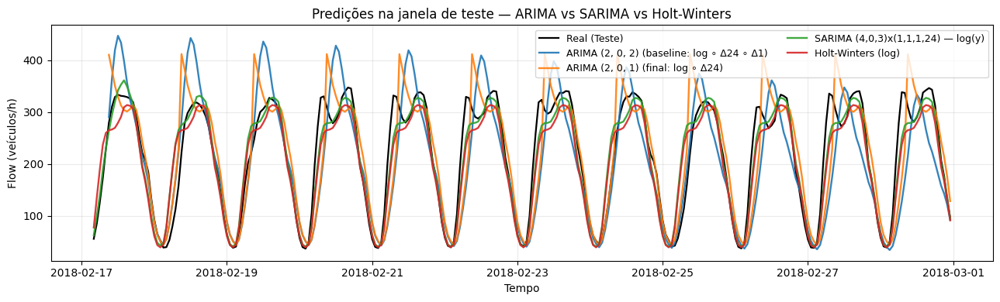

# 🚗 Projeto 1 — Previsão de Fluxo de Tráfego (PEMS04)

## 📘 Contexto

Este projeto faz parte da disciplina **PPGEEC2327 — Predição de Séries Temporais com Inteligência Artificial**,  
do Programa de Pós-Graduação em Engenharia Elétrica e Computação (UFRN).

O estudo tem como objetivo **prever o fluxo horário de veículos** com base em dados do conjunto **PEMS04**,  
utilizando modelos clássicos de séries temporais — **ARIMA**, **SARIMA** e **Holt-Winters** —  
com foco em comparar o desempenho e a adequação de cada abordagem à série analisada.

O vídeo no Youtube demonstra o passo a passo do projeto: 

---

## 📊 Conjunto de Dados

Os dados foram obtidos do repositório público do [Kaggle – PEMS Dataset](https://www.kaggle.com/datasets/elmahy/pems-dataset).

- **Região:** Los Angeles (Caltrans PEMS).  
- **Sensores:** 307 detectores de tráfego.  
- **Frequência original:** 5 minutos.  
- **Período:** cerca de 59 dias contínuos.  
- **Variáveis originais:**  
  - `flow` — número de veículos por intervalo;  
  - `occupancy` — tempo em que o sensor esteve ativo (%);  
  - `speed` — velocidade média dos veículos.

Para reduzir o custo computacional, foi criada uma **série agregada** com:
- a média do fluxo (`flow`) entre todos os sensores;
- reamostragem dos dados para **frequência horária (1 h)**.

Arquivo resultante:  
- `./data/PEMS04/pems_mean_1h.csv`

---

## 🧭 Pipeline de Processamento

O pipeline completo pode ser resumido em cinco etapas principais:

1. **Carregamento e visualização inicial**
   - Leitura da série temporal do fluxo médio horário.
   - Verificação de valores ausentes e consistência temporal.
   - Plot da série original.

   

2. **Análise de estacionariedade**
   - Aplicação dos testes **ADF (Dickey–Fuller)** e **KPSS**.
   - Identificação de forte sazonalidade e ausência de tendência pronunciada.

3. **Análise espectral**
   - Cálculo do **periodograma** e do método de **Welch**.  
   - A principal sazonalidade foi identificada em **24 horas**,  
     com picos secundários próximos de 12 h e 8 h.

   

4. **Transformações e diferenciações**
   - Testes com combinações de transformações (`log`, `boxcox`, `Δ(1)`, `Δ(24)`),  
     avaliando AIC, BIC e estacionariedade após cada sequência.
   - A sequência selecionada como **baseline** foi:  
     $$
     \text{log} \circ \Delta(24) \circ \Delta(1)
     $$
   - A sequência final, mais simples e igualmente estável, foi:  
     $$
     \text{log} \circ \Delta(24)
     $$

5. **Modelagem e previsão**
   - Avaliação de três modelos principais:  
     - **ARIMA** (baseline e final)  
     - **SARIMA** (capturando sazonalidade de 24 h diretamente)  
     - **Holt-Winters** (suavização exponencial sazonal)

---

## ⚙️ Modelagem

### 🔹 ARIMA (baseline)

Transformação aplicada: `log ∘ Δ(24) ∘ Δ(1)`  
Ordem selecionada via análise de ACF/PACF: **ARIMA(2,0,2)**.

Resultados de diagnóstico:

| Métrica | Valor |
|----------|-------|
| AIC | -2910.81 |
| BIC | −2880.73 |
| Ljung–Box (lag 12) | p = 0.039 |
| Ljung–Box (lag 24) | p ≈ 2.0e-08 |
| Ljung–Box (lag 36) | p ≈ 3.7e-10 |

Os resíduos apresentaram autocorrelação significativa, indicando espaço para melhoria.

---

### 🔹 ARIMA (final)

Transformação aplicada: `log ∘ Δ(24)`  
Ordem: **ARIMA(2,0,2)**.

| Métrica | Valor |
|----------|-------|
| AIC | −2927.09 |
| BIC | −2902.01 |
| Ljung–Box (lag 12) | p = 0.85 |
| Ljung–Box (lag 24) | p ≈ 2.5e-05 |
| Ljung–Box (lag 36) | p ≈ 2.0e-06 |

O modelo reduziu a autocorrelação dos resíduos nos primeiros lags,  
mostrando melhor adequação e menor complexidade.

---

### 🔹 SARIMA

Modelo sazonal aplicado diretamente à série em escala logarítmica:  
$$
SARIMA(4,0,3) \times (1,1,1,24)
$$

| Métrica | Valor |
|----------|-------|
| AIC | −3416.29 |
| BIC | −3381.39 |
| Ljung–Box (lag 12) | p ≈ 0 |
| Ljung–Box (lag 24) | p ≈ 0 |
| Ljung–Box (lag 36) | p ≈ 0 |

Apesar do menor AIC/BIC, os resíduos apresentaram forte autocorrelação,  
sugerindo que parte da estrutura sazonal não foi completamente capturada.

---

### 🔹 Holt–Winters

Modelo de suavização exponencial sazonal multiplicativo,  
aplicado à série logarítmica com período sazonal de 24 h.

| Métrica | Valor |
|----------|-------|
| AIC | −5183.25 |
| BIC | −5052.42 |
| Ljung–Box (lag 12) | p ≈ 0 |
| Ljung–Box (lag 24) | p ≈ 0 |
| Ljung–Box (lag 36) | p ≈ 0 |

Os resíduos também indicaram autocorrelação significativa,  
embora as previsões apresentem comportamento suave e coerente.

---

## 📈 Comparação de Previsões

As previsões dos três modelos sobre a partição de teste  
mostraram coerência geral, com o SARIMA apresentando melhor estabilidade.

---

## 📊 Métricas de Desempenho

| Modelo | Transformação | MAE | RMSE | MAPE | R² |
|:--|:--|:--|:--|:--|:--|
| ARIMA(2,0,2) | log ∘ Δ24 ∘ Δ1 | 49.24 | 67.79 | 23.14% | 0.59 |
| ARIMA(2,0,1) | log ∘ Δ24 | 44.01 | 60.80 | 23.46% | 0.67 |
| SARIMA(2,0,2)×(1,1,1,24) | log(y) | 21.62 | 32.83 | 13.68% | 0.90 |
| Holt–Winters | log | 26.90 | 37.30 | 15.45% | 0.88 |

---

## 🧩 Conclusões

- A análise espectral revelou um **componente sazonal dominante de 24 h**,  
  o que justificou o uso de diferenciação sazonal ou modelo SARIMA.
- O modelo **SARIMA(2,0,2)×(1,1,1,24)** obteve os **melhores resultados quantitativos**, embora ainda com resíduos autocorrelacionados.
- O **Holt–Winters** conseguiu obter um desempenho próximo ao do **SARIMA**, com um BIC bem menor.

---

## 🧠 Referências

- Box, G. E. P., Jenkins, G. M., Reinsel, G. C., & Ljung, G. M. (2015). Time Series Analysis: Forecasting and Control. John Wiley & Sons.
- Hyndman, R. J., & Athanasopoulos, G. (2021). Forecasting: Principles and Practice. OTexts.